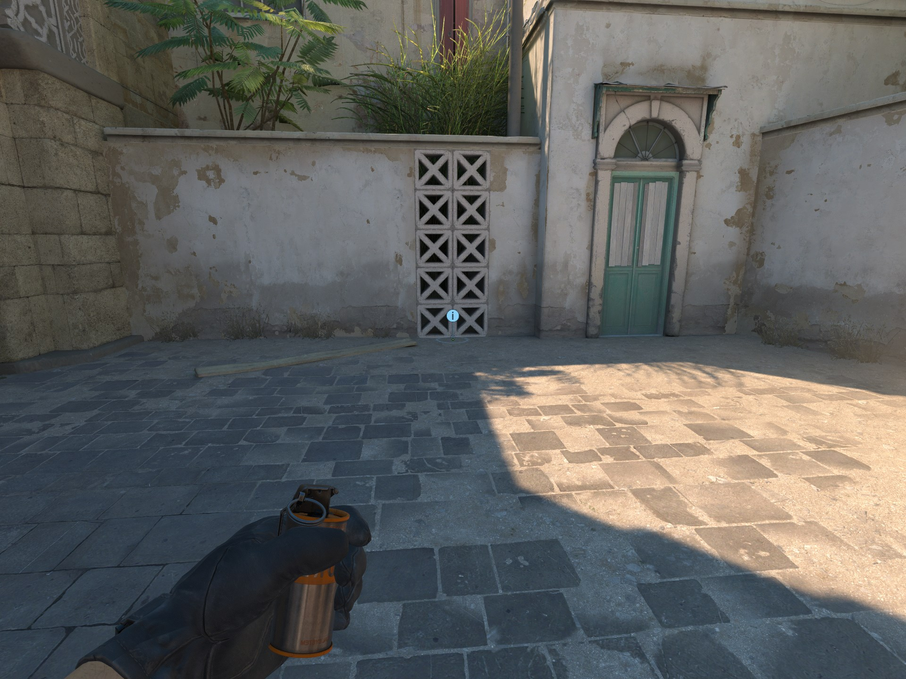
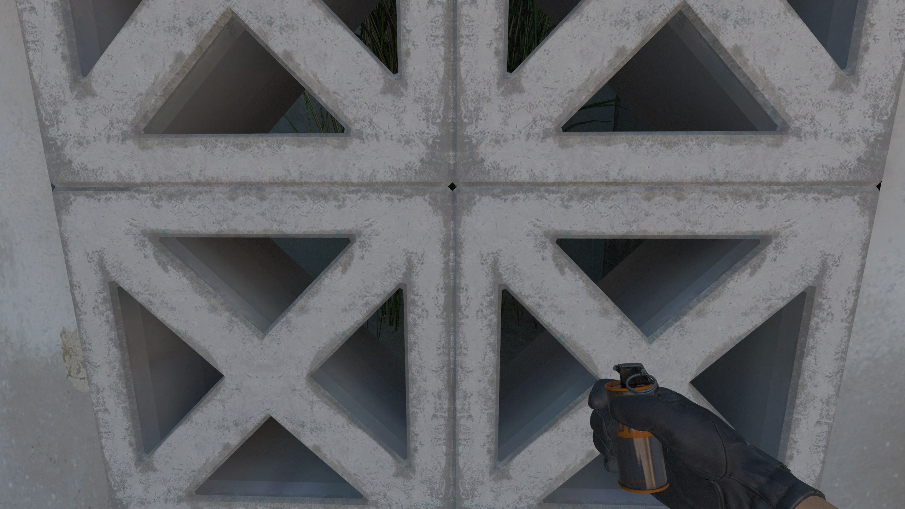
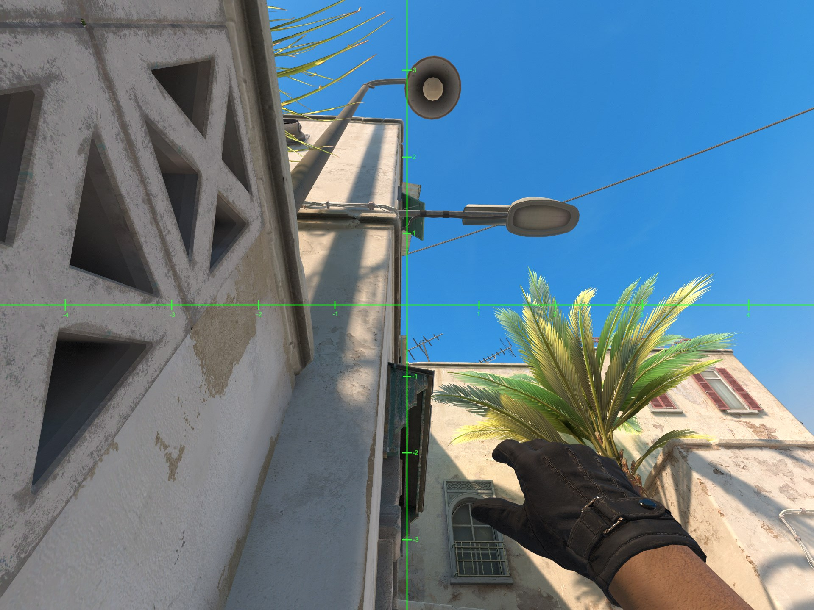

# Long CT Cross Smoke Dust 2

1. Stand here.

2. Align yourself to look straight at this line in the wall.

3. Aim your smoke crosshair so that the right angle between the crosshair and the -1 step are to the left of the little cube in the blue wood.
4. Left click throw.

