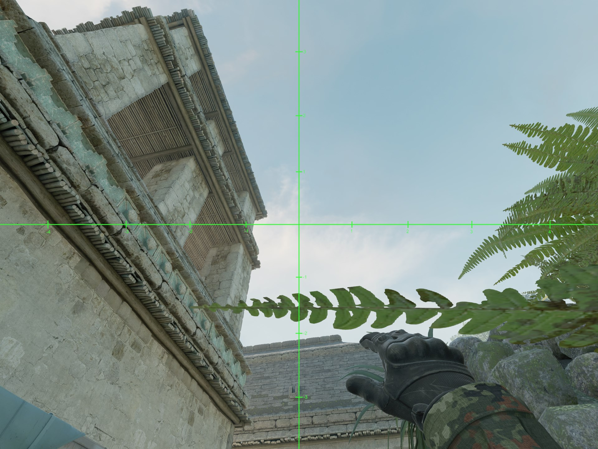

# A Retake from B Site Smoke Ancient

1. Stand in the center of this plant.

2. Aim so that the left-hand side of the -3 step in the smoke reticle cradles this rectangular protrusion in the wall.
3. Standing left click jump throw.

