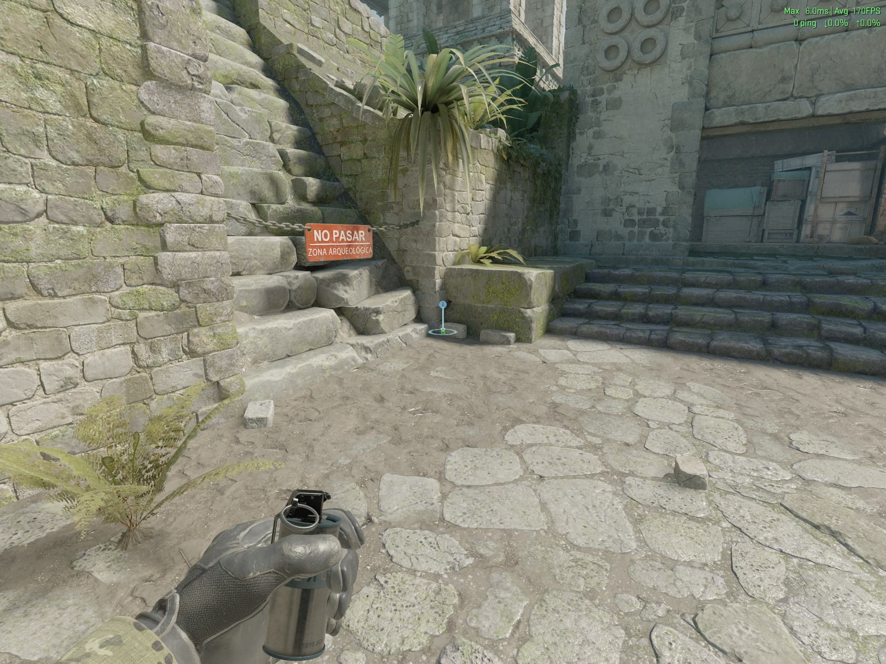
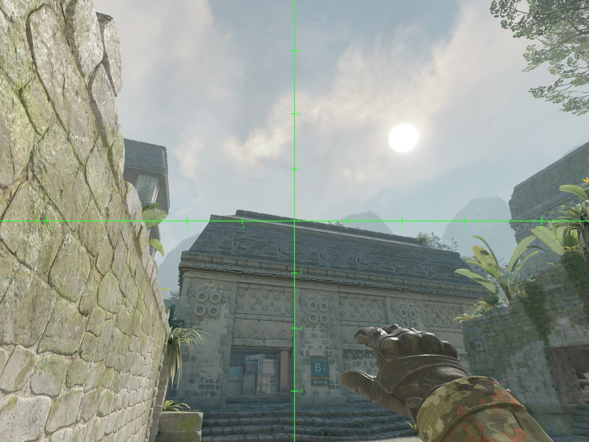
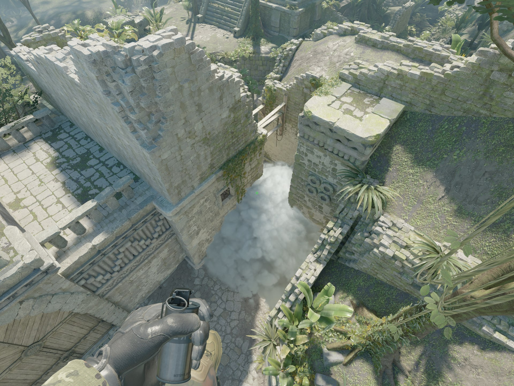

# T Mid Smoke Ancient

1. Stand here.

2. Aim so that the vertical line of the smoke reticle lines up this this corner of the building and aim for the top of the building.

3. Running left click jump throw (release as soon as you reach the bottom of the brick you aimed at previously).

