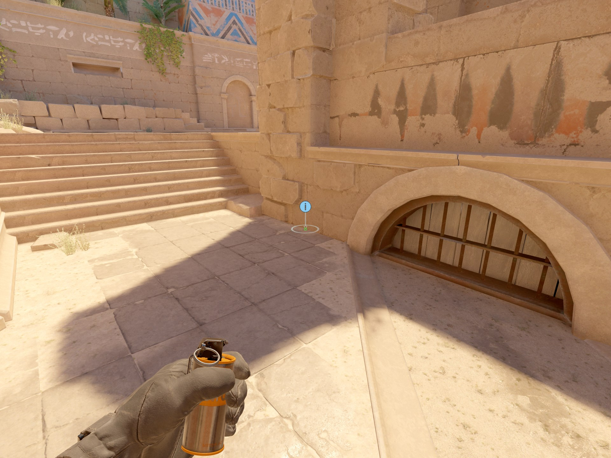
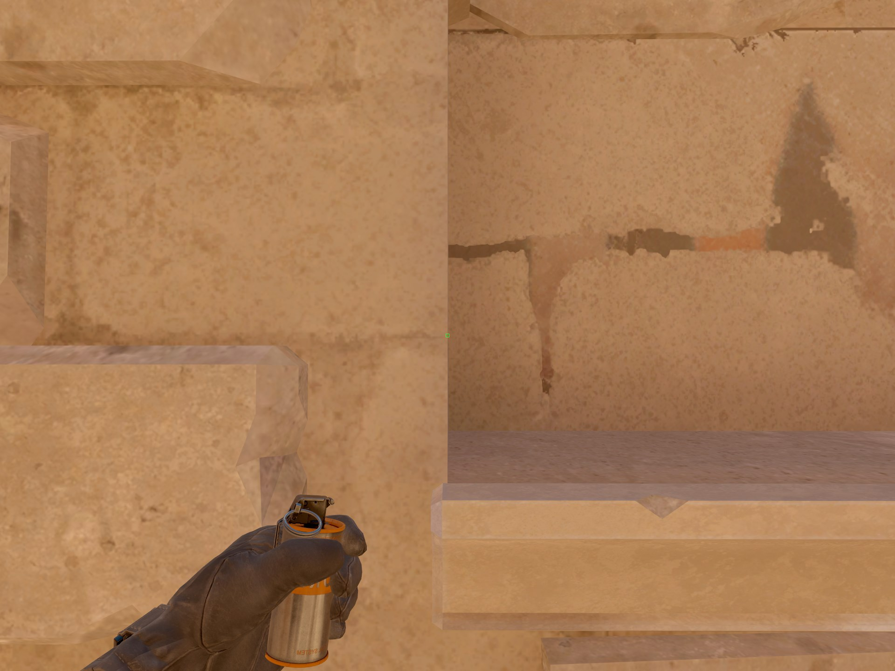
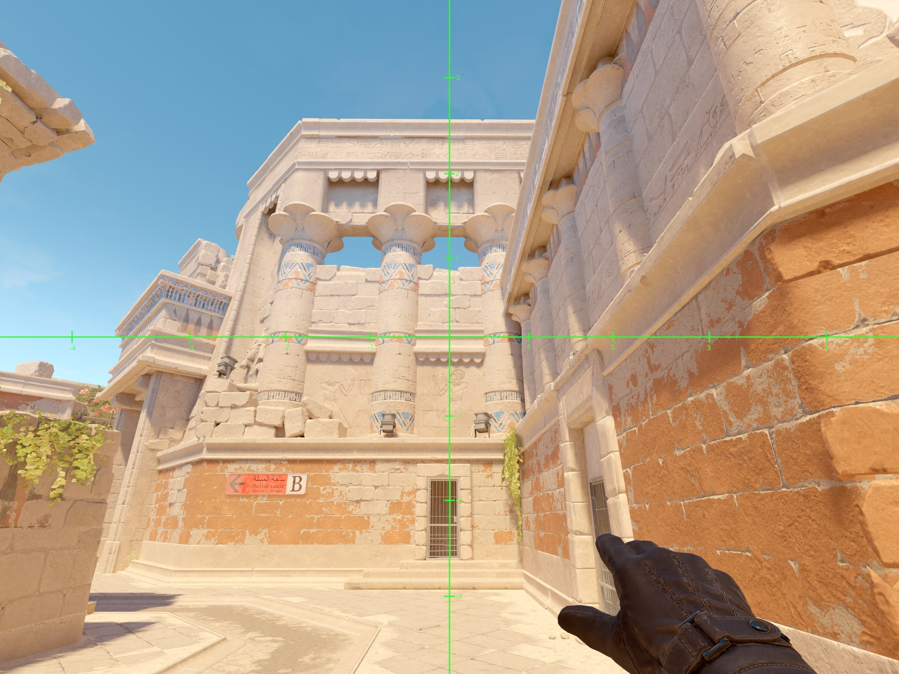
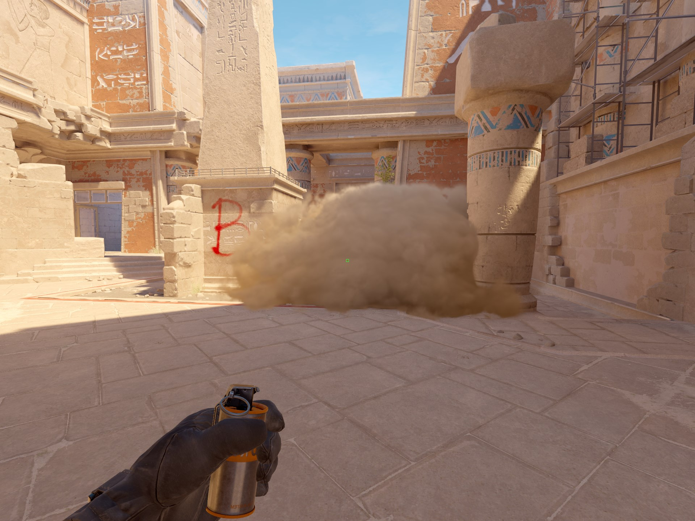

# B Cross Smoke Anubis

1. Stand here.

2. Align with the end of this wall.

3. Aim at the bottom line above the decorative stone row, while the vertical axis of the smoke reticle is aligned with the center of the stone row.
4. Standing left and right click jump throw.

