# T Smokes

## Garage from T Spawn

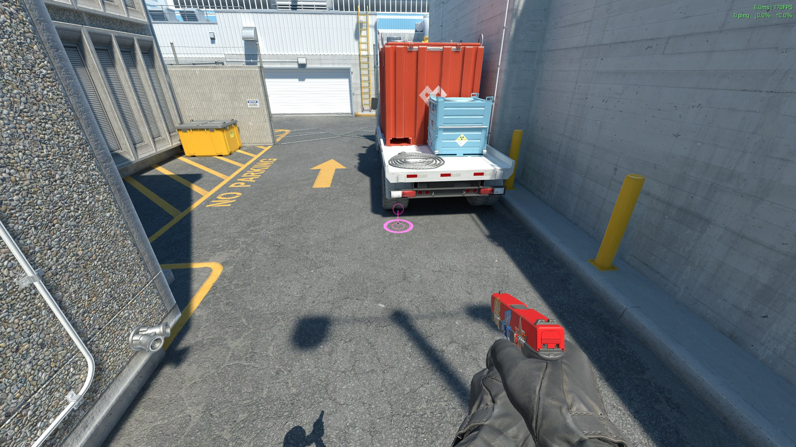

Stand here.

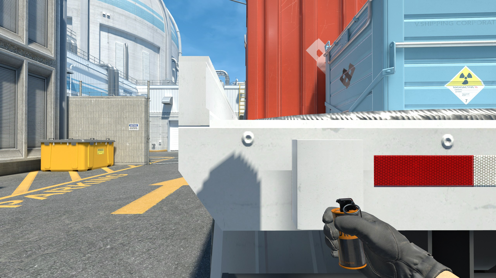

Aim at this screw while crouching.

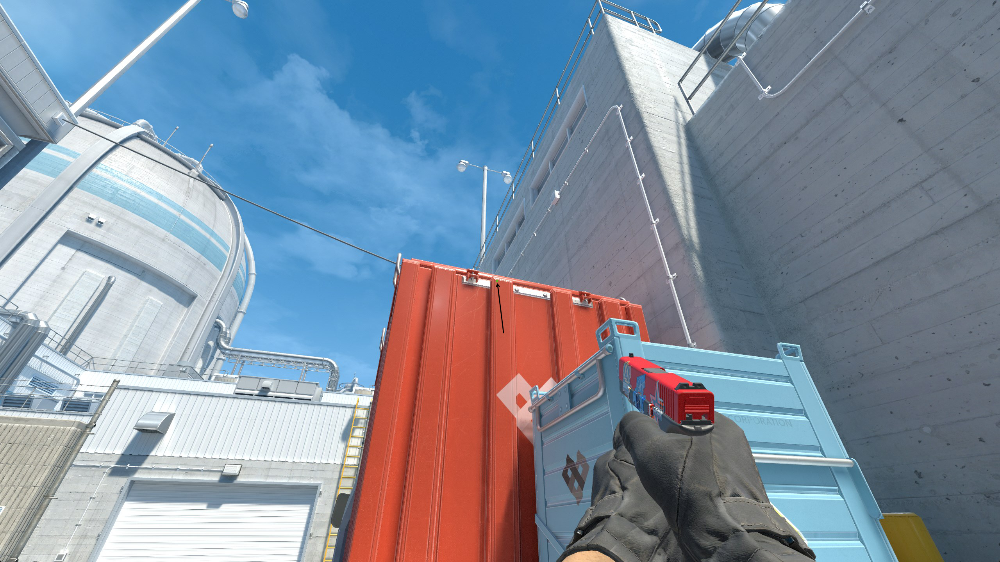

1. Look at the second full-size container panel
2. Aim at the top left corner of the largest face of the panel
3. Standing jump throw

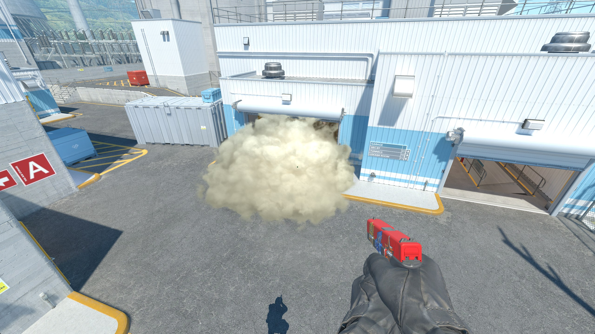

Result T-side

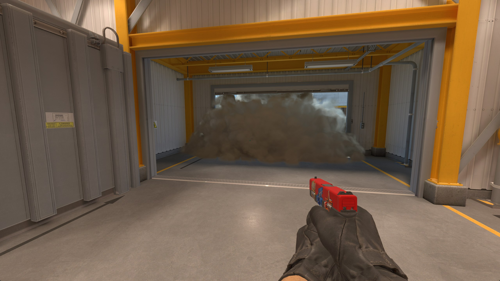

Result CT-side (can still cover main)

## Vent Rush

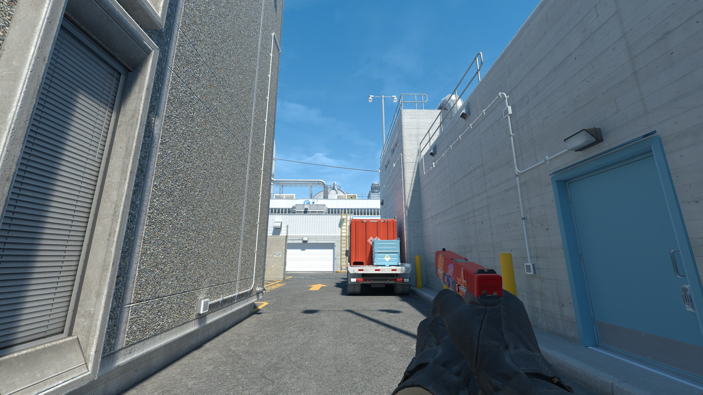

Shoot out the right window from T spawn.

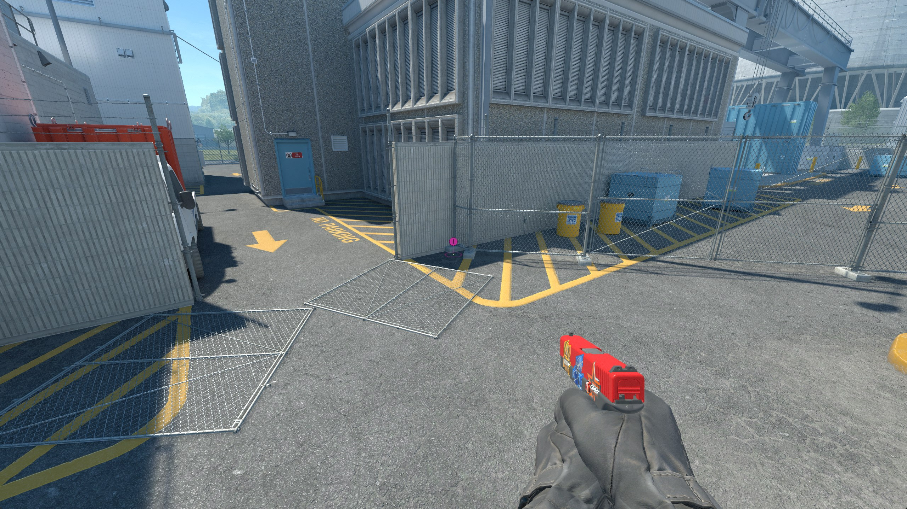

Stand here.

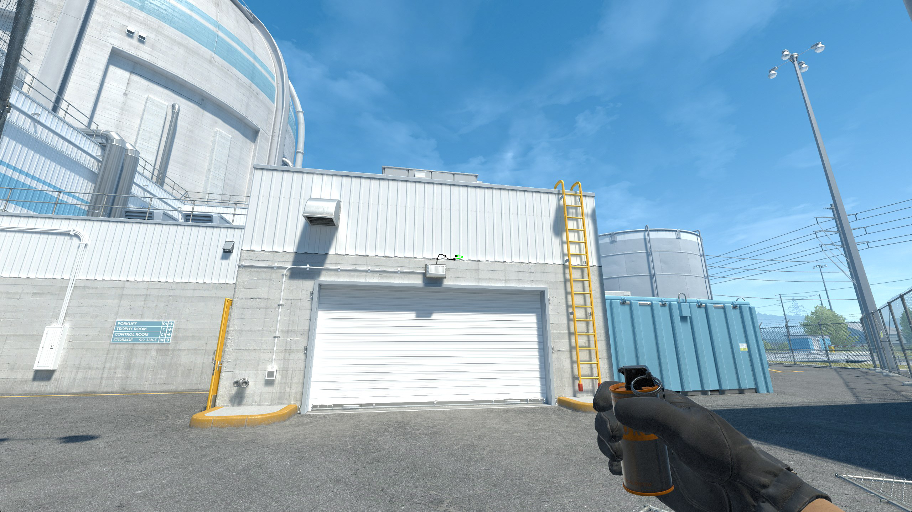

1. Find the top middle of the white box above the garage
2. Aim at the panel above the box
3. Count three panels to the right (the initial panel is first one)
4. Aim at the line where the container texture changes from grey to white
5. Standing jump throw

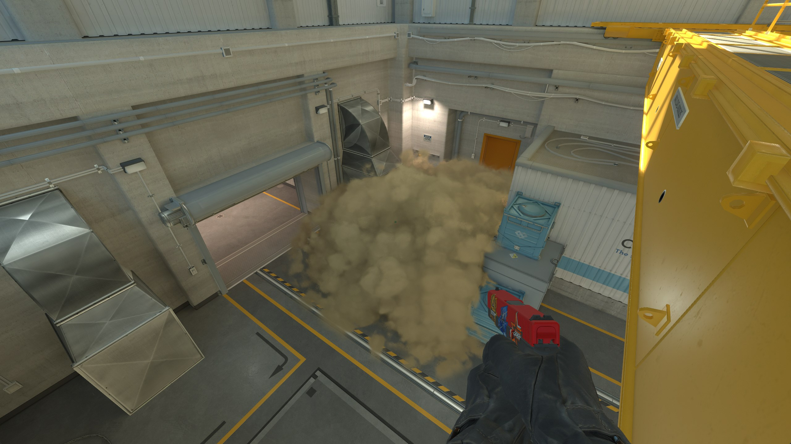

Result CT-side

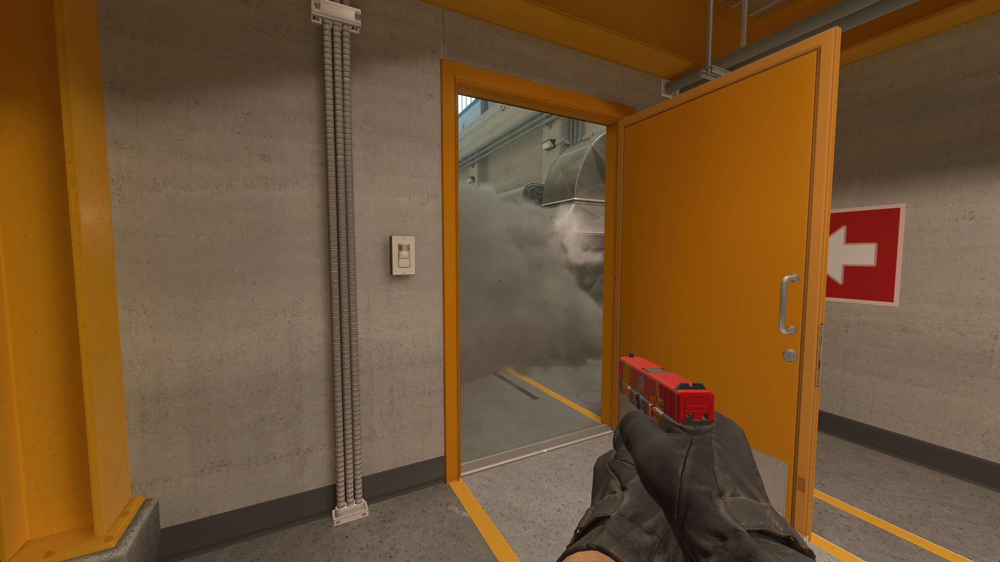

Result T-side

## Heaven from T Roof

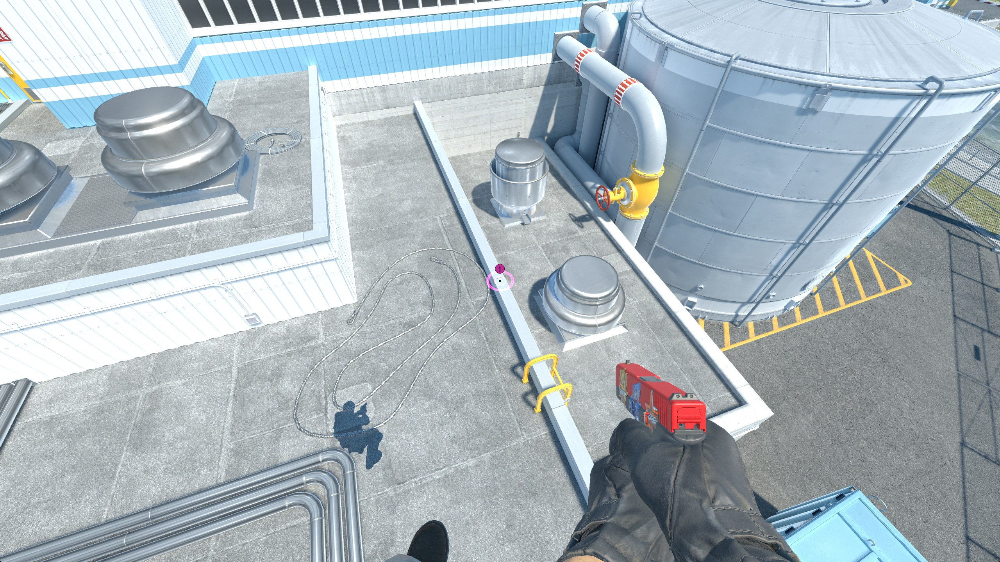

Stand here.

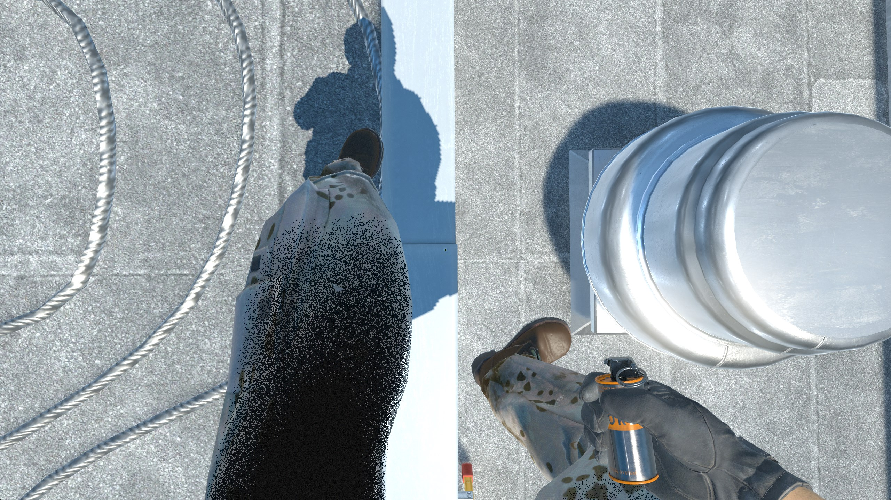

Aim crosshair at this screw while looking down.

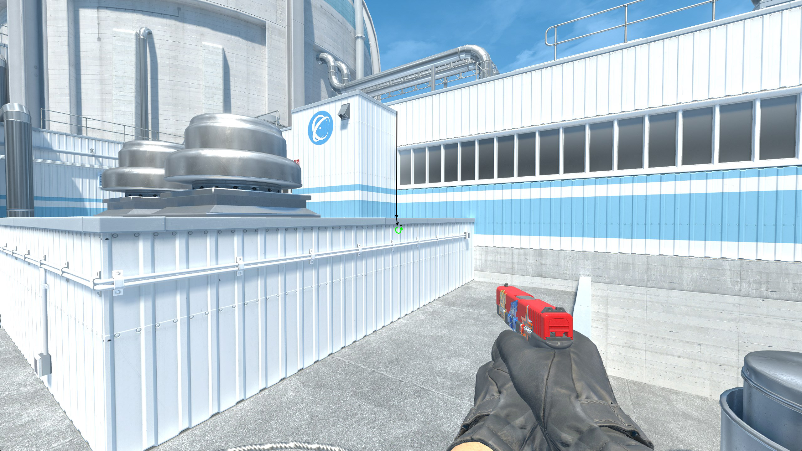

1. Find the ridge
2. Find the first bolt in-line with the ridge
3. Aim at the first bolt to the right
4. Standing jump throw

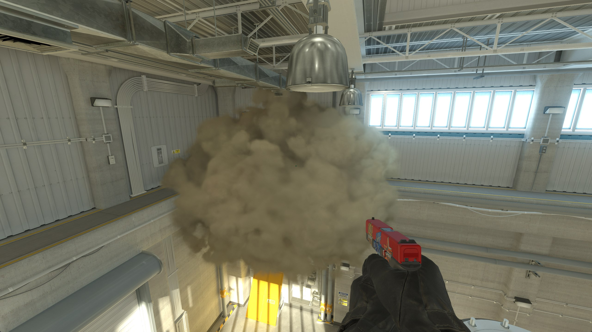

Result
