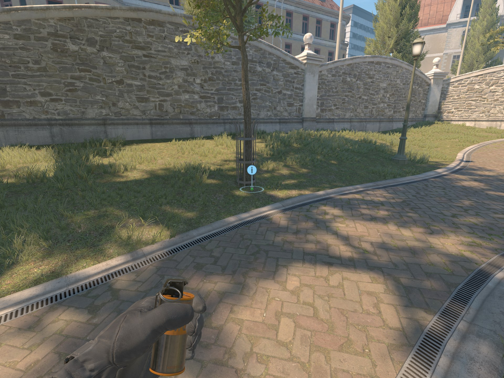
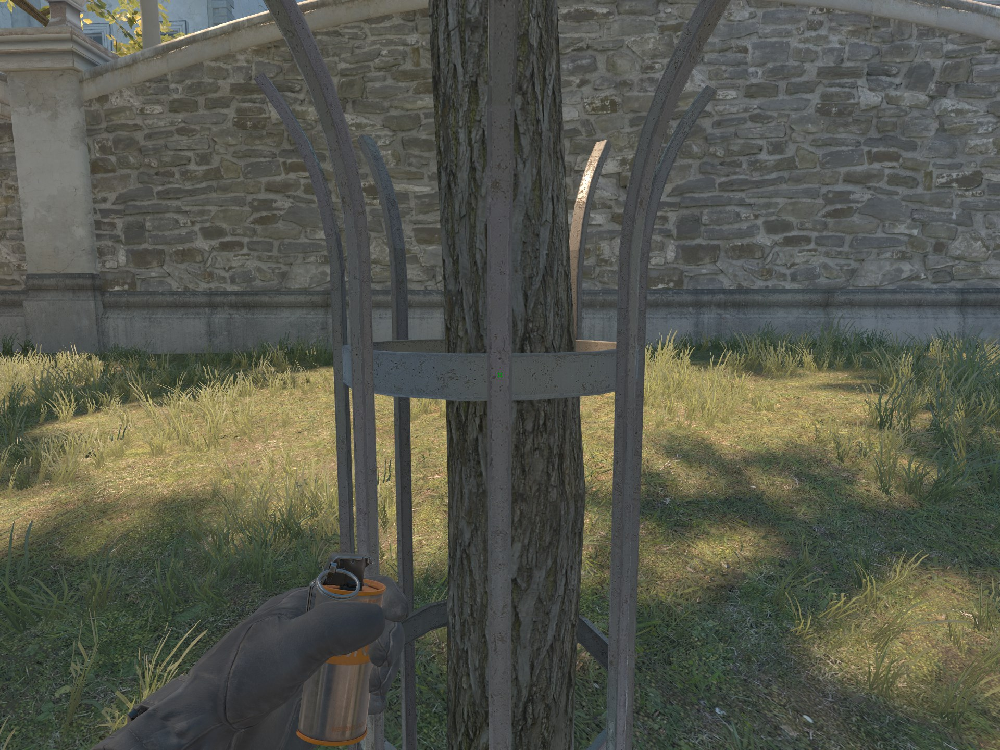
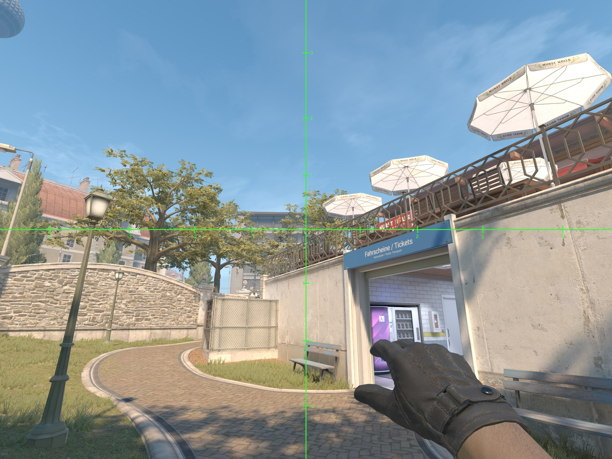
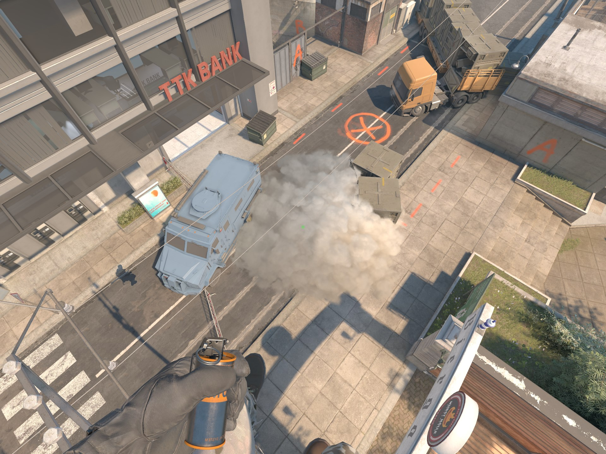

# A Long Push Smoke

1. Stand here.

2. Align with the center of this fence pole.

3. Aim so that the -2 of the smoke reticle aligns with the top left corner of this bench.
4. Standing left click jump throw.

