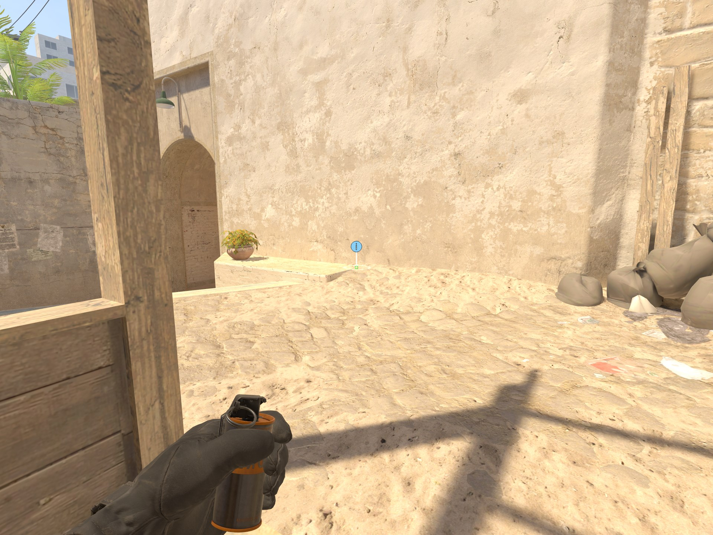
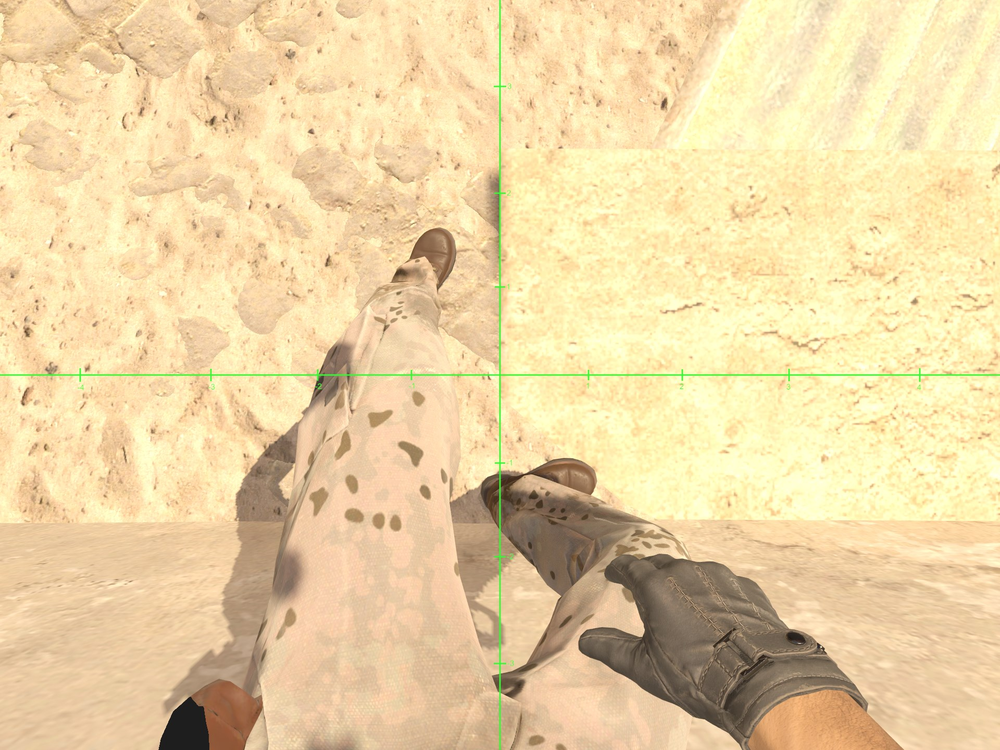
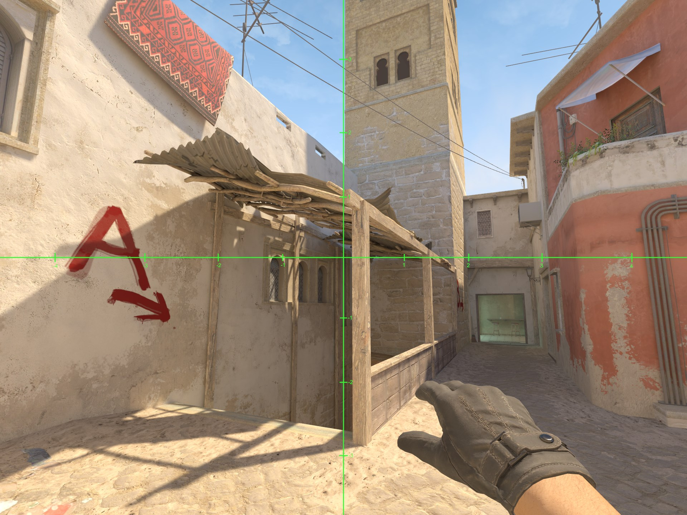
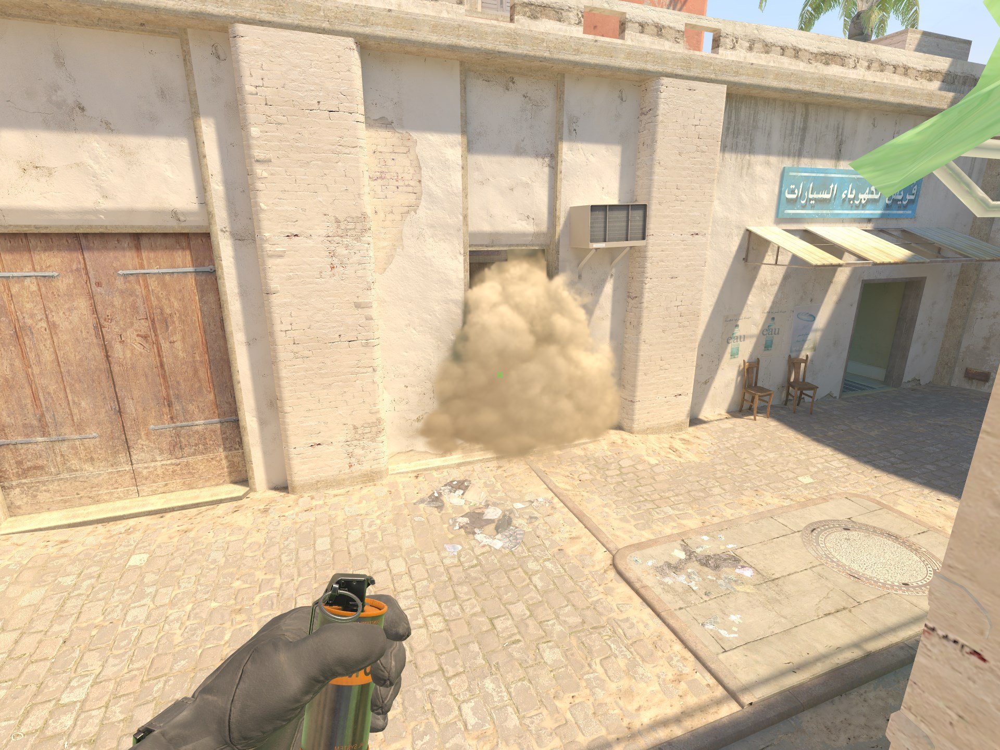

# B Window Smoke Mirage

1. Stand in this corner.

2. Align with the line on the ground.

3. Aim at the center of these two boards while the horizontal line of the smoke reticle intersects with the corner of this window frame.
4. Standing left click jump throw.

