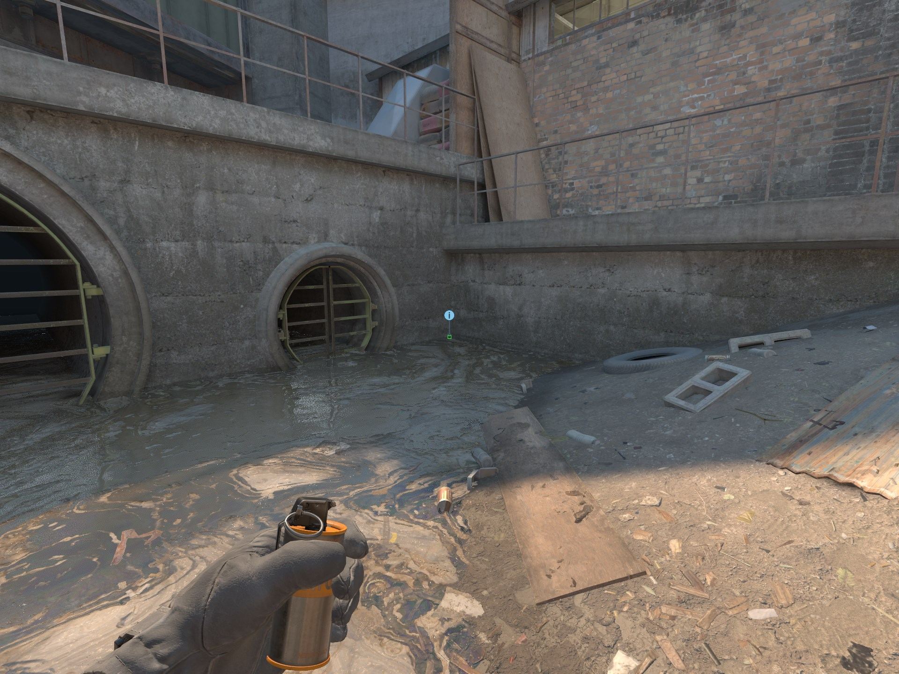
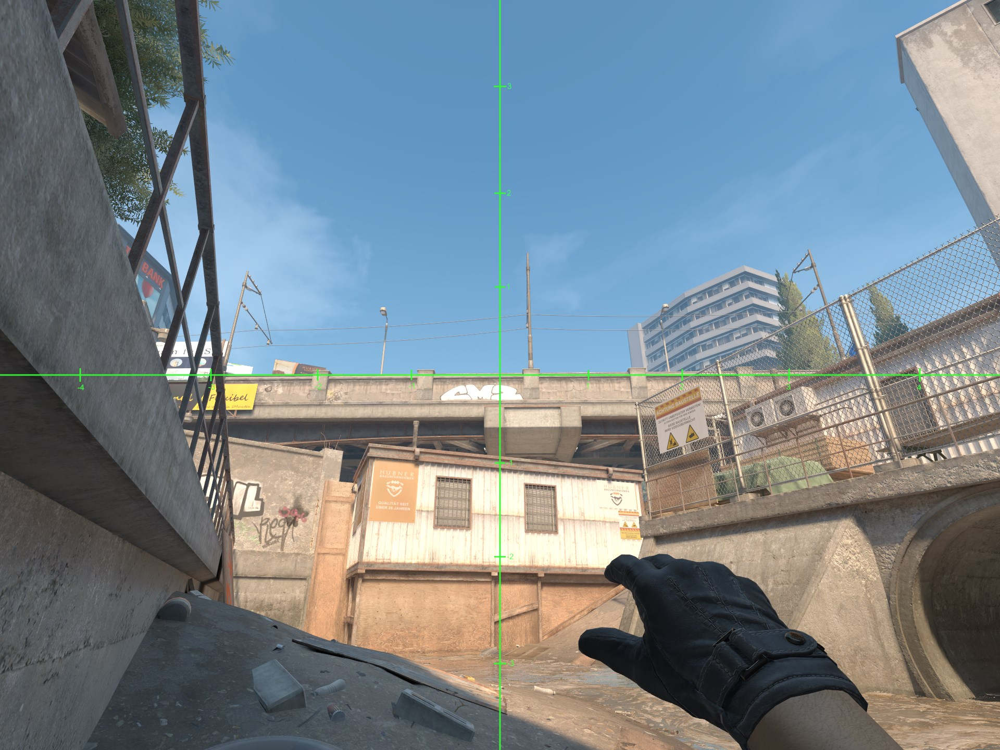
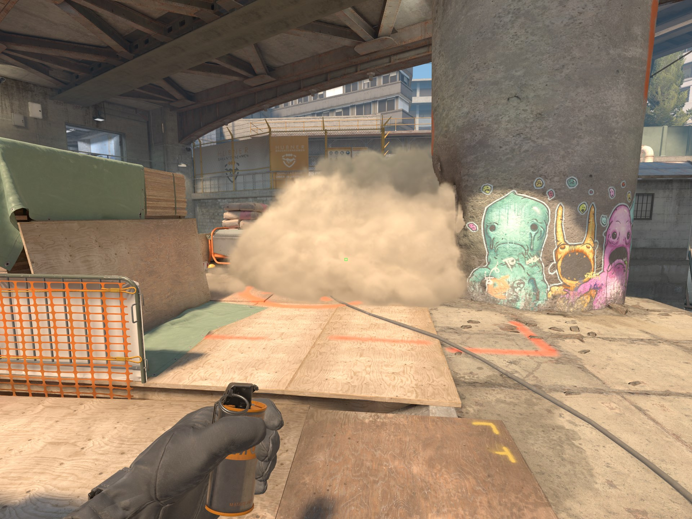

# B Water Smoke Overpass

1. Stand in this corner.

2. Aim so that the 4 of the smoke reticle aligns with the intersection of the brown door frame and the railing. (right tolerance > left tolerance)
3. Standing left click throw.

